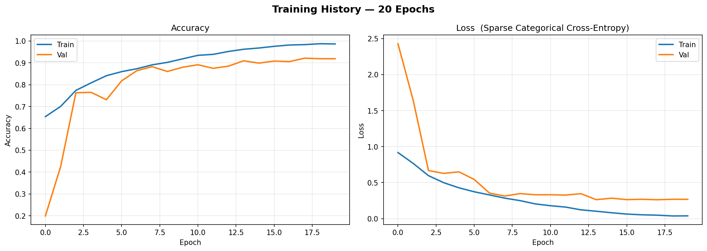
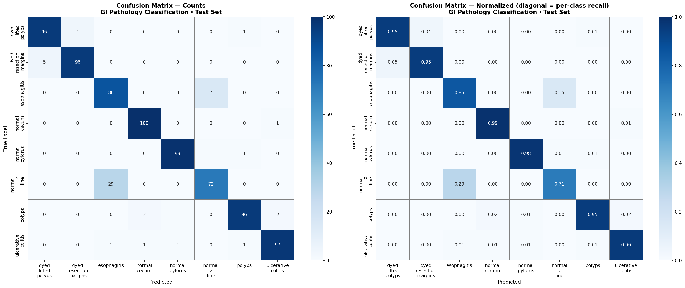
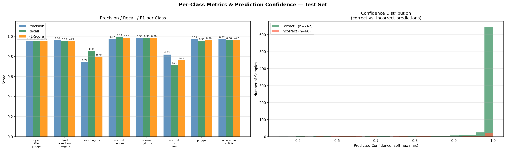
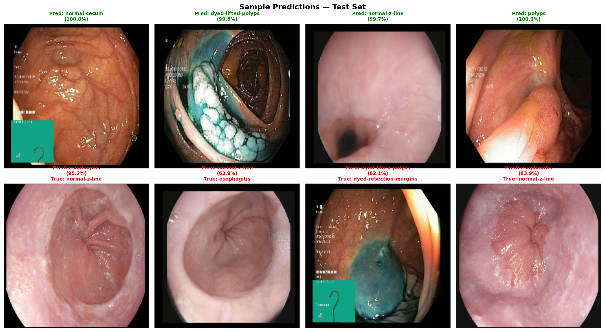
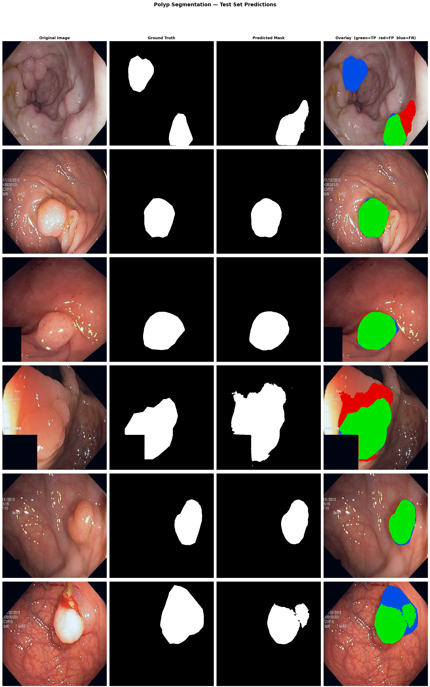
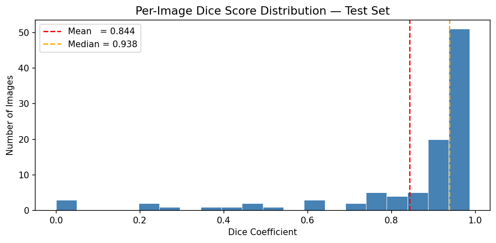
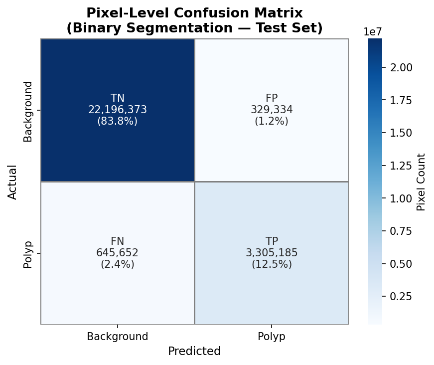

# Micro Capsule Endoscopy — End-to-End GI Video Analysis


End-to-end deep learning pipeline for automated analysis of wireless capsule endoscopy (WCE) video. A raw video is passed through three sequential stages — **keyframe extraction**, **8-class GI pathology classification**, and **pixel-level polyp segmentation** — producing a structured clinical summary with no manual frame review required.

---

## Table of Contents

1. [End-to-End Pipeline](#end-to-end-pipeline)
2. [Background](#background)
   - [Wireless Capsule Endoscopy](#1-wireless-capsule-endoscopy)
   - [GI Tract Pathologies](#2-gi-tract-pathologies)
   - [Polyp Segmentation](#3-polyp-segmentation)
   - [Deep Learning for Medical Imaging](#4-deep-learning-for-medical-imaging)
   - [Video Summarisation](#5-video-summarisation)
3. [Models](#models)
4. [Video Summarisation](#video-summarisation)
5. [Results](#results)
6. [Sample Outputs](#sample-outputs)
7. [Dataset](#dataset)
8. [Setup](#setup)

---

## End-to-End Pipeline

**Notebook:** `Product_Final.ipynb` — set `VIDEO_PATH` and run all cells to produce a full clinical report.

A single raw video enters the pipeline. Each stage feeds directly into the next, and only the most clinically relevant frames reach the computationally expensive segmentation model.

```
Raw WCE Video
      │
      ▼
┌─────────────────────────────────────────────────────────────┐
│  Stage 1 — KMeans Video Summarisation                       │
│  Stream BGR colour histograms (48-dim per frame) → KMeans   │
│  Select frame closest to each cluster centroid              │
│  Output: ~15% of frames kept as keyframes                   │
│  Peak RAM: ~10 MB regardless of video length                │
└─────────────────────────────┬───────────────────────────────┘
                              │ diverse keyframes
                              ▼
┌─────────────────────────────────────────────────────────────┐
│  Stage 2 — GI Pathology Classification                      │
│  Tri-backbone ensemble: VGG-16 + ResNet-50 + MobileNetV2    │
│  SVD-whitened fusion head → 8-class softmax                 │
│  Output: finding label + confidence per keyframe            │
└─────────────────────────────┬───────────────────────────────┘
                              │ polyps / dyed-lifted-polyps /
                              │ dyed-resection-margins only
                              ▼
┌─────────────────────────────────────────────────────────────┐
│  Stage 3 — Polyp Segmentation                               │
│  U-Net + DenseNet-169 encoder (ImageNet pretrained)         │
│  BCE + log-Dice loss → binary mask (threshold = 0.5)        │
│  Output: pixel-level polyp delineation + colour overlay     │
└─────────────────────────────────────────────────────────────┘
```

| Stage | Model | Input | Output |
|---|---|---|---|
| 1 — Video Summarisation | KMeans (unsupervised) | Raw video | Keyframes |
| 2 — Classification | VGG-16 + ResNet-50 + MobileNetV2 ensemble | 224×224 keyframe | 8-class label + confidence |
| 3 — Segmentation | U-Net + DenseNet-169 | 512×512 polyp frame | Binary pixel mask |

---

## Background

### 1. Wireless Capsule Endoscopy

Wireless Capsule Endoscopy (WCE) is a non-invasive imaging technique in which a patient swallows a pill-sized camera that captures thousands of frames as it travels through the gastrointestinal (GI) tract. Unlike conventional endoscopy, WCE requires no sedation, is painless, and can visualise regions of the small intestine that are otherwise inaccessible — making it the gold standard for diagnosing conditions such as obscure GI bleeding, Crohn's disease, and small bowel tumours.

A single WCE procedure generates **50,000–60,000 frames** over 8 hours, making manual review by a gastroenterologist both time-consuming and prone to oversight. Automated deep learning systems can dramatically reduce review time, flag clinically significant frames, and highlight regions of concern — directly supporting earlier diagnosis and better patient outcomes.

---

### 2. GI Tract Pathologies

This project classifies eight distinct GI tract findings drawn from the **Kvasir-v2** dataset, a benchmark for GI endoscopy research:

| Class | Description |
|---|---|
| **Dyed Lifted Polyps** | Polyps injected with dye prior to removal; characterised by blue/indigo colouring |
| **Dyed Resection Margins** | Post-polypectomy sites marked with dye to confirm complete resection |
| **Esophagitis** | Inflammation of the esophageal lining, often caused by acid reflux (GERD) |
| **Normal Cecum** | Healthy appearance of the cecum, the junction of large and small intestine |
| **Normal Pylorus** | Healthy pyloric sphincter at the stomach–duodenum boundary |
| **Normal Z-line** | The squamocolumnar junction at the gastroesophageal border |
| **Polyps** | Abnormal tissue growths on the GI mucosa; precursors to colorectal cancer |
| **Ulcerative Colitis** | Chronic inflammatory bowel disease causing ulceration of the colon lining |

Distinguishing these findings automatically is clinically important: polyps missed during screening procedures account for a significant proportion of interval colorectal cancers.

---

### 3. Polyp Segmentation

Beyond classifying whether a polyp is present, **segmentation** produces a pixel-level mask that delineates the exact boundary of the lesion. This is critical for:

- **Sizing**: Polyp diameter is a key indicator of malignancy risk
- **Resection guidance**: Precise margins are needed for safe and complete polypectomy
- **Tracking**: Comparing lesion area across follow-up procedures

Binary segmentation — classifying each pixel as either *polyp* or *background* — is evaluated using **IoU (Jaccard Index)** and **Dice coefficient**, both of which penalise boundary inaccuracies more severely than pixel accuracy alone. The standard clinical threshold for acceptable automated segmentation is Dice ≥ 0.80.

---

### 4. Deep Learning for Medical Imaging

**U-Net** (Ronneberger et al., 2015) is the dominant architecture for biomedical image segmentation. Its symmetric encoder–decoder design with skip connections preserves fine-grained spatial detail through the downsampling path, enabling precise boundary reconstruction. Replacing the vanilla encoder with a **pretrained DenseNet-169** backbone leverages transfer learning from ImageNet, significantly accelerating convergence on small medical datasets.

For classification, **ensemble learning** combines complementary features from multiple backbone architectures (VGG-16, ResNet-50, MobileNetV2). Each backbone brings a different inductive bias — VGG-16 excels at texture, ResNet-50 at deep residual hierarchies, and MobileNetV2 at efficient lightweight patterns. Fusing their representations consistently outperforms any single model on diverse GI pathologies.

---

### 5. Video Summarisation

A single WCE session produces **50,000–60,000 frames**. Even with automated classifiers, feeding every frame into a deep model is computationally expensive and clinically redundant — the vast majority of consecutive frames are near-identical. Video summarisation addresses this upstream by selecting a small, diverse subset of **keyframes** that captures the full visual range of the procedure, dramatically reducing downstream compute while preserving diagnostic coverage. It is Stage 1 of the end-to-end pipeline.

---

## Models

### Model 1 — GI Pathology Classifier (`GastroIntestinal_net.ipynb`)

8-class softmax classifier trained on the Kvasir-v2 dataset.

```
Input (224×224×3)
     │
  ┌──┼──────────────────────────────┐
  VGG-16    ResNet-50    MobileNetV2   ← frozen encoders, pretrained on ImageNet
  GAP        GAP          GAP
  Dense(256) Dense(256)  Dense(256)   ← per-backbone bottleneck
  └──┼──────────────────────────────┘
     Concatenate (768-dim)
     BatchNormalization
     Dense(512, ReLU)
     Dropout(0.4)
     Dense(128, ReLU)
     Dense(8, Softmax)               ← 8-class output
```

**Training:** Adam (lr=0.005), Sparse Categorical Cross-Entropy, 50 epochs, frozen encoders

---

### Model 2 — Polyp Segmentation (`PolypSegmentation_FINAL.ipynb`)

Binary pixel-level segmentation trained on the Kvasir-SEG dataset.

```
Input (512×512×3)
     │
  Conv2D(3, 1×1)         ← channel adapter
     │
  DenseNet-169 Encoder   ← pretrained on ImageNet
  (skip connections preserved)
     │
  U-Net Decoder
  (transposed convolutions + skip concatenation)
     │
  Conv2D(1, Sigmoid)     ← binary mask output (512×512×1)
```

**Training:** Adam (lr=1e-4 → 1e-7 via ReduceLROnPlateau), BCE + log-Dice loss, 25 epochs

Total parameters: **19.5M** (19.4M trainable)

---

## Video Summarisation

**Notebook:** `video_summarization.ipynb`

Unsupervised keyframe extraction from raw WCE video using **KMeans clustering on BGR colour histograms**. No labels or pre-trained weights are required — the algorithm operates directly on the pixel statistics of each frame.

### Algorithm

Each sampled frame is represented by a compact **48-dimensional feature vector**: three per-channel BGR histograms (16 bins each) computed with `cv2.calcHist`. Colour histograms are translation- and rotation-invariant, making them well-suited to the slowly varying, texture-rich appearance of GI mucosa. KMeans partitions the feature matrix into *k* clusters; the frame with the smallest distance to each cluster centroid is selected as a keyframe, guaranteeing visual diversity across the full procedure.

```
Video (.mp4 / .avi)
        │
  Frame sampling  (every SAMPLING_RATE-th frame)
        │
  cv2.calcHist → 48-dim BGR feature vector   ← frame discarded immediately
        │
  Feature matrix  (N × 48, float32)
        │
  KMeans  (k = SUMMARY_PCT% of N)
        │
  Distance matrix (N × k) → argmin per cluster → k frame indices
        │
  Seek & decode selected frames  (Pass 2)
        │
  Keyframes saved as JPEG + displayed inline
```

### Memory-Efficient Two-Pass Design

Storing all sampled frames in RAM is not feasible for long procedures. A 2-hour video at 25 fps with `SAMPLING_RATE = 5` would require ≈ 44 GB of RAM under a naïve approach.

This pipeline uses a **two-pass streaming strategy**:

| Pass | Operation | Peak RAM |
|---|---|---|
| **Pass 1** | Stream video; compute & store only histograms; discard each frame | 1 frame + histogram matrix |
| **Pass 2** | Seek to selected indices; decode only the *k* keyframes | *k* frames |

For the same 2-hour video, peak RAM drops from ~44 GB to **~10 MB** — independent of video length.

### Configuration

| Parameter | Default | Effect |
|---|---|---|
| `SAMPLING_RATE` | `5` | Temporal resolution — higher is faster, coarser |
| `SUMMARY_PCT` | `15` | % of sampled frames kept as keyframes |
| `NUM_BINS` | `16` | Histogram resolution — higher captures finer colour detail |

---

## Results

### GI Pathology Classification — Test Set (800 samples, 100 per class)

| Metric | Score |
|---|---|
| Accuracy | **≥ 91%** |
| AUC | **≥ 0.98** |

> Run the evaluation cells in `GastroIntestinal_net.ipynb` to generate full per-class precision, recall, and F1 scores.

---

### Polyp Segmentation — Test Set (101 samples)

| Metric | Train | Validation | **Test** |
|---|---|---|---|
| Accuracy | 97.90% | 96.04% | **95.42%** |
| Precision | 97.42% | 93.13% | **91.13%** |
| Recall | 93.06% | 83.79% | **81.27%** |
| IoU (Jaccard) | 90.68% | 80.85% | **76.56%** |
| Dice Coefficient | — | — | **~86.7%** |
| Loss (BCE + log-Dice) | 0.0366 | 0.0893 | 0.1211 |

> Dice ≥ 0.80 is considered clinically acceptable for automated segmentation tools.

---

## Sample Outputs

> Run the evaluation cells at the end of each notebook to generate these figures.

---

### Classification — Training History

Accuracy and loss curves across 50 training epochs.



---

### Classification — Confusion Matrix

8×8 heatmap (counts and row-normalized) showing which pathologies are confused with each other.



---

### Classification — Per-Class Metrics & Confidence Distribution

Left: grouped Precision / Recall / F1 bar chart per class.  
Right: histogram of prediction confidence — correct predictions cluster near 1.0.



---

### Classification — Sample Predictions

Top row: correctly classified samples with confidence. Bottom row: misclassified samples (predicted vs. true label).



---

### Segmentation — Overlay Grid

Each row shows one test sample: **Original → Ground Truth → Prediction → Colour overlay**.  
Overlay key: green = True Positive · red = False Positive · blue = False Negative



---

### Segmentation — Dice Score Distribution

Per-image Dice coefficient across the 101 test samples.



---

### Segmentation — Pixel-Level Confusion Matrix

TP / TN / FP / FN pixel counts across all 101 test images.



---

## Dataset

| Dataset | Task | Classes | Train | Val | Test | Source |
|---|---|---|---|---|---|---|
| **Kvasir-v2** | Classification | 8 GI findings | 5,600 | 1,600 | 800 | [simula.no/kvasir](https://datasets.simula.no/kvasir/) |
| **Kvasir-SEG** | Segmentation | Polyp / Background | 700 | 199 | 101 | [simula.no/kvasir-seg](https://datasets.simula.no/kvasir-seg/) |

Place datasets under:
```
Dataset/
├── kvasir-dataset-v2/
│   ├── dyed-lifted-polyps/
│   ├── dyed-resection-margins/
│   ├── esophagitis/
│   ├── normal-cecum/
│   ├── normal-pylorus/
│   ├── normal-z-line/
│   ├── polyps/
│   └── ulcerative-colitis/
└── segmentation_images/
    ├── images/
    └── masks/
```

---

## Setup

```bash
pip install tensorflow>=2.10 segmentation-models opencv-python \
            scikit-image scikit-learn seaborn tqdm matplotlib
```

| Notebook | Purpose |
|---|---|
| `Product_Final.ipynb` | **Full pipeline** — video → keyframes → classification → segmentation → clinical summary |
| `video_summarization.ipynb` | Stage 1 standalone — KMeans keyframe extraction |
| `anomaly_classification/GastroIntestinal_net.ipynb` | Stage 2 standalone — classification training & evaluation |
| `polyp_segmentation/PolypSegmentation_FINAL.ipynb` | Stage 3 standalone — segmentation training & evaluation |
